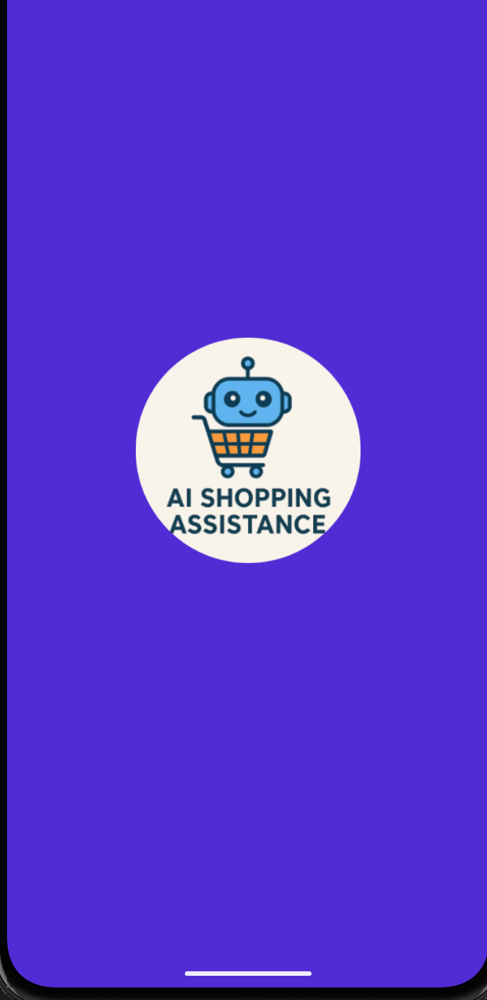
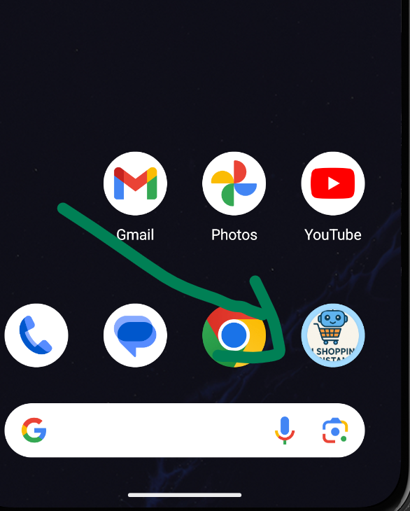
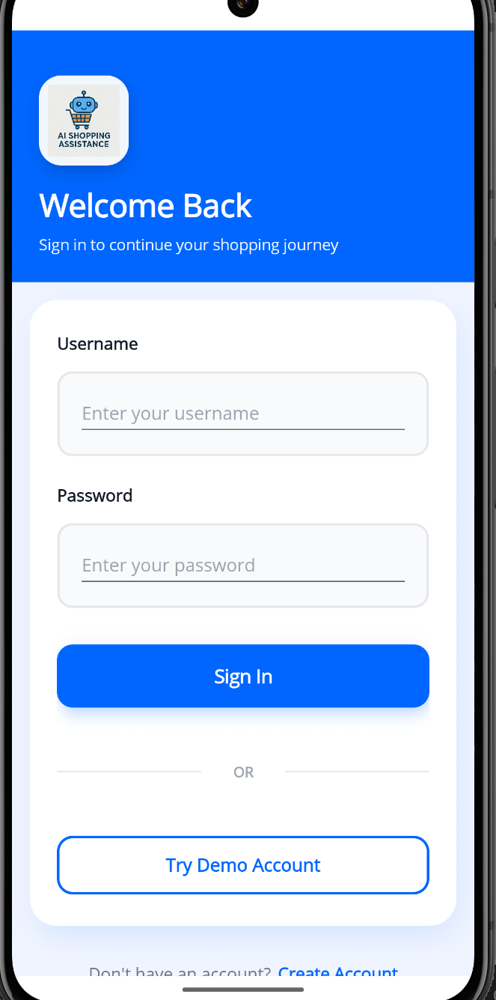
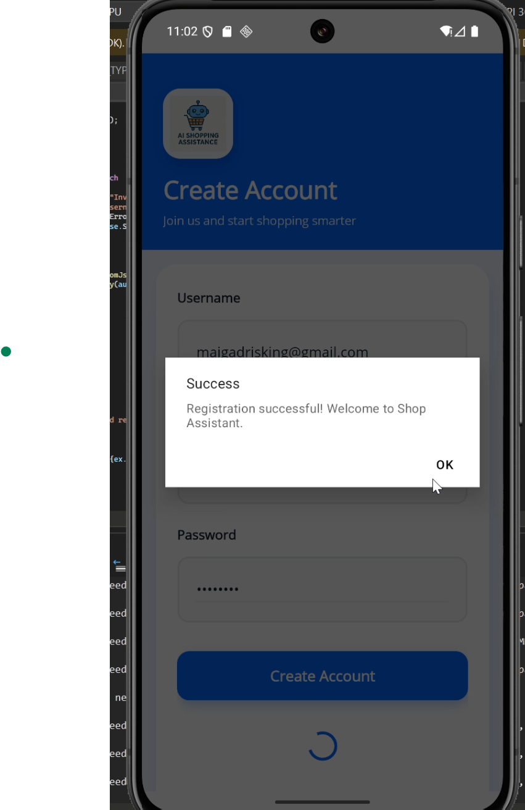
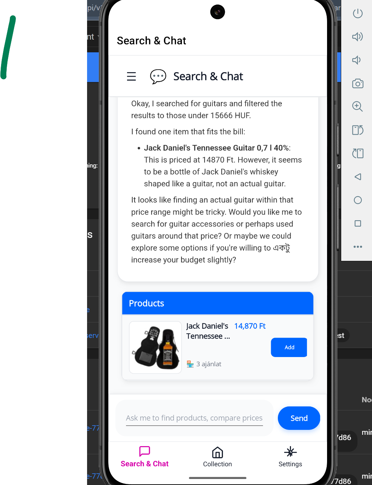
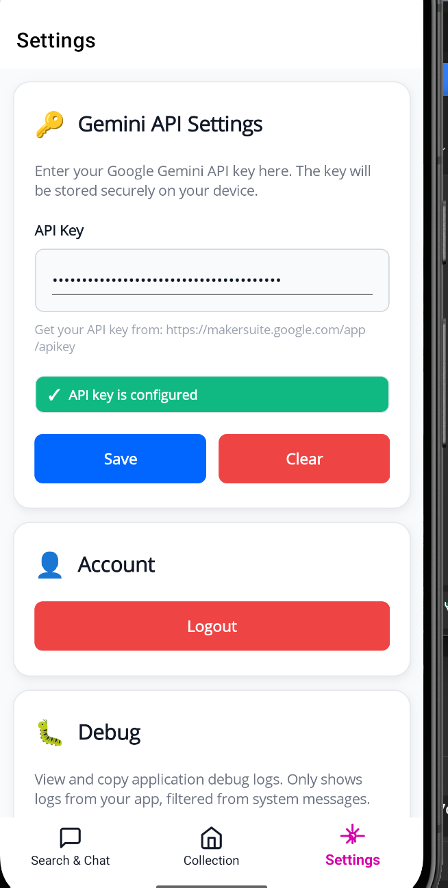

# Product Assistant - Demo Screenshots & Presentation Materials

This folder contains visual demonstrations and presentation materials for the Product Assistant project.

## 📸 Screenshots

### 1. Splash Screen

*Application startup screen with branding*

### 2. App Selection

*Selecting and opening the Product Assistant app*

### 3. Login & Registration

*Auth0 authentication integration - Login and Registration screens*

### 4. Login Screen

*User authentication interface with Auth0*

### 5. Chat Interface (Unified Search & Chat)

*Conversational AI shopping assistant with inline product display. Shows natural language interaction and AI-powered grounding search in action*

### 6. Collection Page

*User's saved products from chat conversations. Features search, filter, and product management functionality*

### 7. Settings Page

*App configuration including API key management and network status display*

### 8. Kubernetes Dashboard

*Kubernetes cluster overview showing all deployments, services, and pods running in the product-assistant namespace*

### Additional Screenshots (To Be Added)

> **Optional**: Add these screenshots if available:

#### Backend - Swagger API Documentation
- File: `swagger-api.png` (optional)
- API endpoints overview
- Interactive API testing interface

#### Docker Desktop - Running Containers
- File: `docker-containers.png` (optional)
- Shows all three microservices running
- Container health status

#### Architecture Diagram
- File: `architecture-diagram.png` (optional)
- Visual representation of microservices architecture
- Service communication flow

## 📊 Presentation Files

### PowerPoint Presentations
- `Product-Assistant-AI-Powered-Shopping-Experience.pptx` - Main presentation
- `Product-Assistant-AI-Powered-Shopping-Experience (1).pptx` - Presentation variant

### PDF Documents
- `Product-Assistant-AI-Powered-Shopping-Experience.pdf` - Main presentation (PDF)
- `Product-Assistant-AI-Powered-Shopping-Experience (1).pdf` - Presentation variant (PDF)

## 🎥 Demo Video

> **Note**: The demo video file (522 MB) is too large for GitHub (max 100 MB). 

**To view the demo video:**
1. Contact the author for the video file, or
2. Upload to YouTube and add the link here:
   - YouTube: [Upload your demo video](https://www.youtube.com/upload)
   - Add link: `[Demo Video](YOUR_YOUTUBE_URL)`

**Alternative**: Use Git Large File Storage (LFS) to track large files:
```bash
git lfs install
git lfs track "*.mp4"
git add .gitattributes
git add Presentation/demo-video.mp4
git commit -m "Add demo video with LFS"
```

## 📝 How to Capture Screenshots

### For Mobile App (Android Emulator):
1. Run the app in Android Emulator
2. Press `Ctrl + S` or use the camera icon in the emulator toolbar
3. Screenshots are saved to: `C:\Users\[Username]\AppData\Local\Android\Sdk\screenshots\`

### For Mobile App (Windows):
1. Run the app on Windows
2. Press `Win + Shift + S` to use Snipping Tool
3. Or press `PrtScn` and paste into an image editor

### For Web Interfaces (Swagger, Kubernetes Dashboard):
1. Open the interface in your browser
2. Press `F12` to open Developer Tools
3. Use `Ctrl + Shift + P` and type "Screenshot" to capture full page
4. Or use browser extensions like "Full Page Screen Capture"

### For Docker Desktop:
1. Open Docker Desktop
2. Navigate to Containers view
3. Use `Win + Shift + S` to capture screenshot

## 📐 Image Guidelines

- **Format**: PNG for screenshots, JPG for photos
- **Resolution**: Minimum 1920x1080 for desktop, 1080x2400 for mobile
- **File Size**: Optimize to < 500KB per image
- **Naming**: Use kebab-case (e.g., `chat-interface.png`)

## 🎨 Image Editing Tips

Before adding screenshots:
1. **Blur sensitive data**: API keys, personal information, emails
2. **Add annotations**: Use arrows or text to highlight key features
3. **Crop appropriately**: Remove unnecessary UI elements
4. **Consistent styling**: Use same theme/colors across screenshots

## 📂 Folder Structure

```
Presentation/
├── README.md (this file)
│
├── 📱 Mobile App Screenshots
│   ├── splash-screen.png
│   ├── app-selection.png
│   ├── login-registration.png
│   ├── login-screen.png
│   ├── chat-interface.png
│   ├── collection-page.png
│   └── settings-page.png
│
├── 🖥️ Infrastructure Screenshots
│   └── kubernetes-dashboard.png
│
├── 🎥 Demo Video
│   └── demo-video.mp4
│
└── 📊 Presentation Materials
    ├── Product-Assistant-AI-Powered-Shopping-Experience.pptx
    ├── Product-Assistant-AI-Powered-Shopping-Experience (1).pptx
    ├── Product-Assistant-AI-Powered-Shopping-Experience.pdf
    └── Product-Assistant-AI-Powered-Shopping-Experience (1).pdf
```

---

**Author**: Idrissa Maiga  
**Project**: Product Assistant - AI-Powered Shopping Experience  
**GitHub**: [@IdrissaMaiga](https://github.com/IdrissaMaiga)

